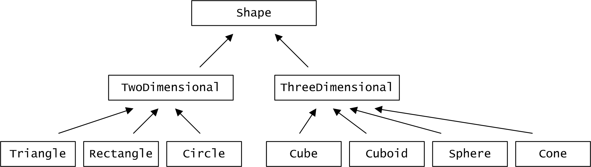

## Eine Klassenhierarchie geometrischer Figuren

Implementieren Sie in dieser Aufgabe eine Hierarchie mit Klassen, die zwei- und dreidimensionale geometrische Figuren repräsentieren. Bei den zweidimensionalen Figuren sollten ein Dreieck (Klasse `Triangle`), ein Viereck (Klasse `Rectangle`) und ein Kreis (Klasse `Circle`) nicht fehlen. Zu den dreidimensionalen Figuren gehören ein Würfel (Klasse `Cube`), eine Kugel (Klasse `Sphere`), ein Kegel (Klasse `Cone`) sowie ein Quader (Klasse `Cuboid`).

Überlegen Sie, welche Instanzvariablen zur Beschreibung der jeweiligen geometrischen Figur notwendig sind. Neben offensichtlichen Instanzvariablen wie der Radius eines Kreises oder die Seitenlänge eines Würfels soll jede Figur eine Positionsangabe besitzen, also einen *x*- und *y*-Wert für eine zweidimensionale Figur bzw. ein Tripel (*x*,*y*,*z*) bei einer dreidimensionalen Figur. Welcher Klasse in der Klassenhierarchie sind diese Positionsvariablen am besten zuzuordnen?

Konzipieren Sie für jede Klasse einen geeigneten Konstruktor. Ziehen Sie, soweit möglich, auch den Basisklassenkonstruktor bei der Erzeugung eines Objekts mit ein.



Entscheiden Sie, welchen Klassen Sie die Eigenschaften `Circumference` (Umfang), `Volume` (Volumen), `Area` (Fläche) und `Surface` (Oberfläche) zuordnen können. Natürlich sollten alle Klassen eine `draw`-Methode besitzen, um ein entsprechendes Objekt auf der Konsole zu „zeichnen“, sprich um seine relevanten Instanzvariablen auszugeben. Eine Methode `moveTo` zur Positionsänderung ist ebenfalls zu realisieren. Die Programmausgabe studieren Sie am folgenden Codefragment:

**Beispiel**:

```dart
import 'package:shapes/circle.dart';
import 'package:shapes/cone.dart';
import 'package:shapes/cube.dart';
import 'package:shapes/cuboid.dart';
import 'package:shapes/rectangle.dart';
import 'package:shapes/sphere.dart';
import 'package:shapes/triangle.dart';

void main() {
  testingInheritance();
}

void testingInheritance() {
  var tria = new Triangle(1, 1, 2, 3, 4);
  tria.Draw();
  var rect = new Rectangle(10, 10, 20, 40);
  rect.Draw();
  var circle = new Circle(20, 20, 10);
  circle.Draw();
  var cube = new Cube(30, 30, 20, 10);
  cube.Draw();
  var cuboid = new Cuboid(50, 50, 40, 10, 20, 30);
  cuboid.Draw();
  var sphere = new Sphere(40, 40, 30, 15);
  sphere.Draw();
  var cone = new Cone(60, 60, 50, 20, 30);
  cone.Draw();
}
```

Neben der Vererbung kann man diese Übung auch gut benutzen, um ein zentrales Paradigma aus der objektorientierten Programmierung,
den *Polymorphismus* oder auch als *Polymorphie* bezeichnet, demonstrieren zu können. Legen Sie dabei das folgende Code-Fragment zu Grunde:

```dart
void testingPolymorphismus() {
  var shapes = List<Shape>();
  shapes.add(new Triangle(1, 1, 2, 3, 4));
  shapes.add(new Rectangle(10, 10, 20, 40));
  shapes.add(new Circle(20, 20, 10));
  shapes.add(new Cube(30, 30, 20, 10));
  shapes.add(new Cuboid(50, 50, 40, 10, 20, 30));
  shapes.add(new Sphere(40, 40, 30, 15));
  shapes.add(new Cone(60, 60, 50, 20, 30));

  for (var shape in shapes) {
	  shape.Draw();
  }
}
```

Diskutieren Sie an der Ausgabe dieses Code-Fragments die Wirkungsweise der for-Wiederholungsanweisung:

```dart
Shape: Triangle
  TwoDimensional
  Position: 1, 1
    A: 2
    B: 3
    C: 3
    Area: 2.82843
    Circumference: 8
Shape: Rectangle
  TwoDimensional
  Position: 10, 10
    Width: 20
    Height: 40
    Area: 800
    Circumference: 120
Shape: Circle
  TwoDimensional
  Position: 20, 20
    Radius: 10
    Area: 314.159
    Circumference: 62.8319
Shape: Cube
  ThreeDimensional
  Position: 30, 30, 20
    Size: 10
    Volume: 1000
    Surface: 600
Shape: Cuboid
  ThreeDimensional
  Position: 50, 50, 40
    Size: 10
    Height: 20
    Depth: 30
    Volume: 6000
    Surface: 2200
Shape: Sphere
  ThreeDimensional
  Position: 40, 40, 30
    Radius: 15
    Volume: 14137.2
    Surface: 2827.43
Shape: Cone
  ThreeDimensional
  Position: 60, 60, 50
    Radius: 20
    Height: 30
    Volume: 12566.4
    Surface: 3522.07
```


